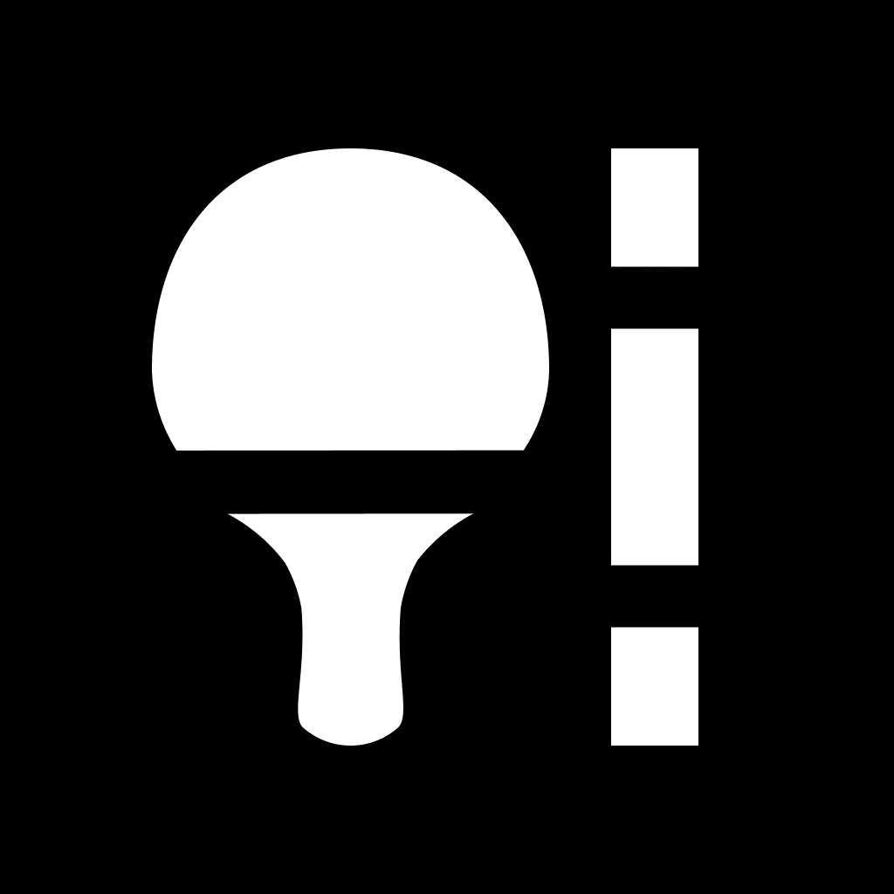

<p align="center">

</p>

# Street pongiste

Application web et mobile (IOS uniquement) de visualisation des tables de ping-pong en accès libre en France métropolitaine.

## api

**stack :** [FastAPI](https://fastapi.tiangolo.com/),[OpenStreetMap via Overpass API](https://overpass-api.de/),[mapbox](https://www.mapbox.com/)

### Installation locale :

#### Installer l'environnement virtuel :

`python -m venv .venv`

#### Activer l'environnement virtuel :

`.\.venv\Scripts\activate.ps1`

#### Installer les dépendances dans l'environnement virtuel :

`pip install -r requirements.txt`

#### Définir les variables d'environnement :

Chaîne de connexion à la bdd MongoDB : **MONGODB_CONNSTRING** :

`$env:MONGODB_CONNSTRING="mongodbconnstring"` avec _mongodbconnstring_ la chaîne de connexion à la bdd

#### Lancer l'API (en mode reload) :

`uvicorn main:app --reload`

## initial-osm-data-in-db

### Installation locale :

#### Installer l'environnement virtuel :

`python -m venv .venv`

#### Activer l'environnement virtuel :

`.\.venv\Scripts\activate.ps1`

#### Installer les dépendances dans l'environnement virtuel :

`pip install -r requirements.txt`

#### Définir les variables d'environnement :

Chaîne de connexion à la bdd MongoDB : **MONGODB_CONNSTRING**.

`$env:MONGODB_CONNSTRING="mongodbconnstring"` avec _mongodbconnstring_ la chaîne de connexion à la bdd

#### Lancer les scripts :

`python osm-data-in-db.py` ou `python tags-data-description-osm-tables-francemetrop.py`

## mobile-app

### Publication d'une nouvelle version sur l'App Store :

```
eas build --platform ios --profile development
expo start --dev-client
```

Après incrémentation de la _version_ et du _buildNumer_ :

```
eas build --platform ios
eas submit -p ios --latest
```

## web-app

### Installation locale :

#### Installation des dépendances :

`npm install`

#### Lancement du serveur de dev :

`npm run dev`

## deployment
